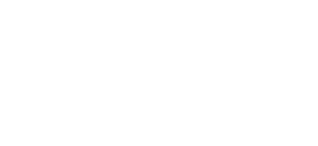

# Vestido Ideal

**Projeto Mobile**
Nele você poderá encontrar o seu vestido ideal. Basta preencher o formulário com seu nome, tamanho, cor. Clicar no botão Mostrar e pronto, 2 vestidos aparecerão liso e bordado. Simples demais, não?

## Etapas do projeto

 
 
 - [x] Layout de formulário com nome, tamanho e cor.
 - [x] Criar botao do formulário.
 - [x] Layout onde vai aparecer os vestidos.
 - [x] Armazenar os dados inseridos pelo usuário.
 - [x] Imprimir esses dados no console.
 - [x] Criar um parágrafo de apresentação com o nome do usuário. 
 - [x] Validação do formulário.
 - [x] Tamanhos e cores disponíveis.
 - [x] Comparar o tamanho e cor inseridos pelo usuário com os objetos dos vestidos.
 - [x] Selecionar os vestidos compatíveis com o tamanho e cor do usuário.
 - [x] Erro de tamanho/ Vestido com o tamanho digitado não encontrado.
 - [x] Erro de cor/Vestido com a cor digitada não encontrado.
 - [x] Corrigir erro de repetição de apresentação quando limpa o formulário
 - [x] Inserir as imagens dos vestidos.
 - [x] Mostrar os vestidos compatíveis separando por lisos e bordados.
 - [x] Resetar vestidos quando for mostrar outros.

## Tecnologias

    

Hospedagem:

 
 
## Imagens

<h3> :camera: Página inicial</h3>

<h3> :camera: Página ativa</h3>

## Licensas

  

  Todos os direitos reservados a ©Felipe Lima - 2022

## Depoimento

 Projeto desafiador, feliz demais e muito satisfeito de ter concluído mais um projeto pessoal. Com o desafio do Pedro Marins de desenvolver um projeto em 7 dias, minha namorada(designer) me ajudou a pensar em um projeto e no design dele, e assim que finalizamos o design eu mergulhei no código. Estou começando a me familiarizar com JS, ao invés de dor de cabeça e cansaço instantânteo, ele está me proporcionando bastante curiosidade e vontade de vencer os desafios. Espero que gostem e vamos para mais um.

## Contato | Redes Sociais

     

## Desenvolvedores

 | [ Felipe Pereira de Lima](https://github.com/LipePLima) 
 | :---: |
